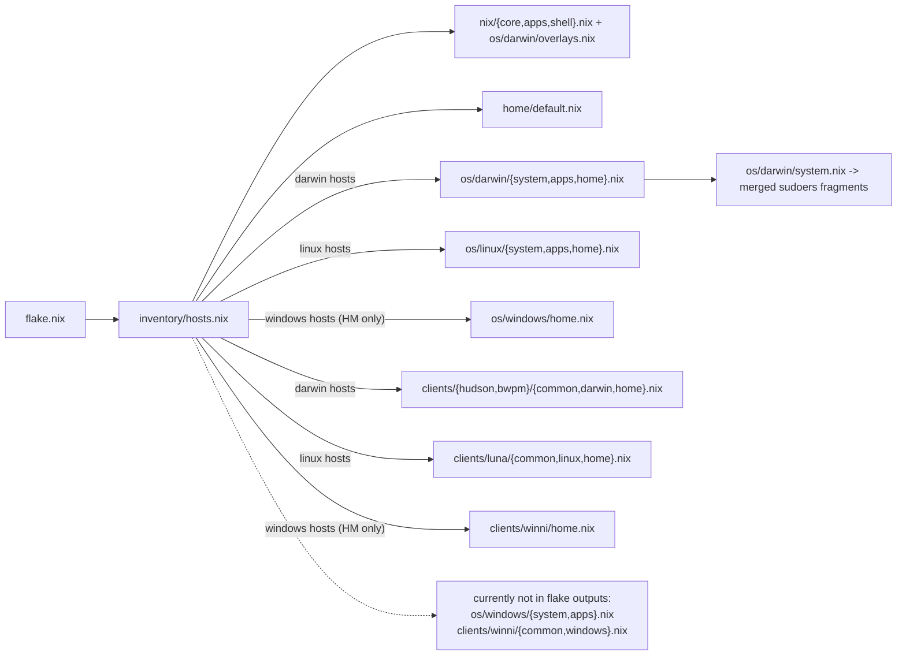

# ststefanix

Nix configuration organized by clear axes: `nix`, `os`, `client`, and `home`.
The goal is predictable composition, minimal duplication, and explicit ownership of settings.

## Concept Overview

This repo models a host configuration as layered deltas:

1. `nix/*` defines cross-platform system foundation.
2. `os/<os>/*.nix` defines platform-specific behavior.
3. `clients/<client>/*.nix` defines client/role-specific system deltas.
4. `home/default.nix` defines user-level baseline, then imports OS/client home deltas.

Think of it as: **foundation -> platform -> role -> user**.

## Axes and Ownership

- `nix/` owns shared system concerns:
  - `nix/core.nix`: Nix settings + host identity baseline.
  - `nix/apps.nix`: shared `environment.systemPackages` baseline.
  - `nix/shell.nix`: shared shell/env defaults.
  - `nix/sudoers.nix`: shared sudoers assembly logic.
- `os/` owns platform constraints and capabilities:
  - `os/<os>/system.nix`, `os/<os>/apps.nix`, `os/<os>/home.nix`.
  - optional `os/<os>/overlays.nix` for platform-only overlay workarounds.
- `clients/` owns host-role differences:
  - `clients/<client>/<os>.nix` for system deltas.
  - `clients/<client>/secrets.nix` for Vault secret mappings.
  - `clients/<client>/home.nix` for Home Manager deltas.
- `home/` owns user-level reusable modules and files.

Rule: place code where its **reason to change** belongs.

## Inventory-Driven Composition

`inventory/hosts.nix` is the source of truth for host metadata.
Each host entry provides identity and runtime facts (for example `client`, `os`, `system`, `username`, `cores`).

`flake.nix` reads inventory and derives outputs by OS:

- `darwinConfigurations` for hosts with `os = darwin`
- `nixosConfigurations` for hosts with `os = linux`
- `homeConfigurations` for hosts with `os = windows` (WSL/Home Manager target)

Inventory attributes are passed via `specialArgs`, so modules can be parameterized without hardcoding host names.

## Sudoers Strategy

Sudoers is assembled declaratively in `nix/sudoers.nix` from plain ASCII fragments:

- OS fragment: `os/<os>/files/etc/sudoers`
- optional client fragment: `clients/<client>/files/etc/sudoers`

The merged result is written to `/etc/sudoers.d/nix-${username}`.
This keeps content editable as text while preserving declarative composition.

## Home Manager Placement Rules

- Global user behavior: `home/*.nix` (for example `home/shell.nix`, `home/git.nix`).
- OS-specific user behavior: `os/<os>/home.nix`.
- Client-specific user behavior: `clients/<client>/home.nix`.

`home.file` definitions are merged by target path; collisions only happen when the same destination is declared twice.

## Vault Runtime Secrets (Linux + Darwin)

`nix/vault-secrets.nix` aggregates two scopes:

- `ststefanix.vaultSystemSecrets`: root/system service (`systemd` / `launchd.daemons`)
- `ststefanix.vaultUserSecrets`: user service/agent (`systemd --user` / `launchd.user.agents`)

Use `vaultUserSecrets` for files in `~` (for example `~/.config/sops/...`).

Example host config (same schema on Linux and Darwin, split by scope):

```nix
{
  ststefanix.vaultUserSecrets = {
    address = "https://vault.heldenzeit.net";

    secrets = {
      age_keys = {
        vault_secret = "kv/data/ststefanix/age_keys";
        # One Vault field contains the full keys.txt payload
        vault_secret_key = "private_key";
        destination = ".config/sops/age/keys.txt";
      };

      gh_token = {
        vault_secret = "kv/data/dev/github";
        vault_secret_key = "token";
      };
    };
  };

  # Typical Linux-style system secret example: private TLS key for nginx.
  # (On Darwin you can also use vaultSystemSecrets, but the concrete consumer differs.)
  ststefanix.vaultSystemSecrets = {
    secrets = {
      nginx_tls_key = {
        vault_secret = "kv/data/web/nginx_tls";
        vault_secret_key = "private_key";
        destination = "/run/secrets/nginx/tls.key";
      };
    };
  };
}
```

Important:
- `vaultUserSecrets` uses `~/.vault-token` (authenticate once as the inventory user via `vault login`)
- `vaultSystemSecrets` uses `/etc/vault.token` (provide a separate root/system token)
Rendered secret files are owned by the host user from `inventory/hosts.nix` (`username`).
Model: one Vault field -> one rendered file.
For `vaultUserSecrets`, `destination` is a path relative to `$HOME` (for example `.config/sops/age/keys.txt`).
If `destination` is set, Vault Agent still writes the physical file into the scope runtime secrets directory, and the module creates a symlink at `destination`.

Offline/reboot behavior:

- The host still boots if Vault is unreachable.
- Vault Agent services retry in the background, but restart attempts are throttled to once per hour.
- Existing rendered secret files remain on disk (last known value) until Vault becomes reachable again and the agent refreshes them.
- Startup diagnostics are written to the service logs (journald on Linux, `/var/log/vault-agent-system-secrets.log` and `~/Library/Logs/vault-agent-user-secrets.log` on Darwin).

## Operational Workflow

Use `just` as the primary entrypoint:

- `just build`: build current host output from inventory.
- `just diff`: compare current generation with newly built result.
- `just apply`: switch to the built configuration for current host OS.
- `just refreshsecrets-system`: refresh system-scoped Vault secrets (sudo)
- `just refreshsecrets-user`: refresh user-scoped Vault secrets (no sudo)
- `just refreshsecrets`: run both refresh targets
- `just rollback`: rollback one generation.

`just` resolves host OS from `.#hostInventory.<hostname>.os`.

## Design Intent

This layout prefers explicit structure over implicit magic:

- fewer hidden couplings,
- easier refactors,
- host portability via inventory,
- clean boundaries between foundation, platform, role, and user settings.

## Building blocks

This shows how the parts are connected together


