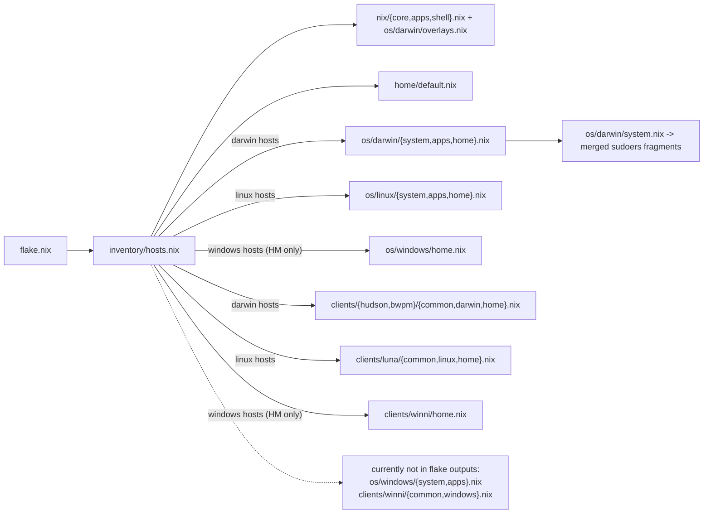

```mermaid
flowchart LR
  flake["flake.nix"]
  hosts["inventory/hosts.nix"]

  flake --> hosts

  base["nix/{core,apps,shell}.nix + os/darwin/overlays.nix"]
  home_default["home/default.nix"]

  os_darwin["os/darwin/{system,apps,home}.nix"]
  os_linux["os/linux/{system,apps,home}.nix"]
  os_windows_home["os/windows/home.nix"]

  clients_darwin["clients/{hudson,bwpm}/{common,darwin,home}.nix"]
  clients_linux["clients/luna/{common,linux,home}.nix"]
  clients_windows_home["clients/winni/home.nix"]

  extra_darwin["os/darwin/system.nix -> merged sudoers fragments"]
  unreachable_windows["currently not in flake outputs:\nos/windows/{system,apps}.nix\nclients/winni/{common,windows}.nix"]

  hosts -->|"darwin hosts"| os_darwin
  hosts -->|"linux hosts"| os_linux
  hosts -->|"windows hosts (HM only)"| os_windows_home

  hosts -->|"darwin hosts"| clients_darwin
  hosts -->|"linux hosts"| clients_linux
  hosts -->|"windows hosts (HM only)"| clients_windows_home

  hosts --> base
  hosts --> home_default

  os_darwin --> extra_darwin
  hosts -.-> unreachable_windows
```
